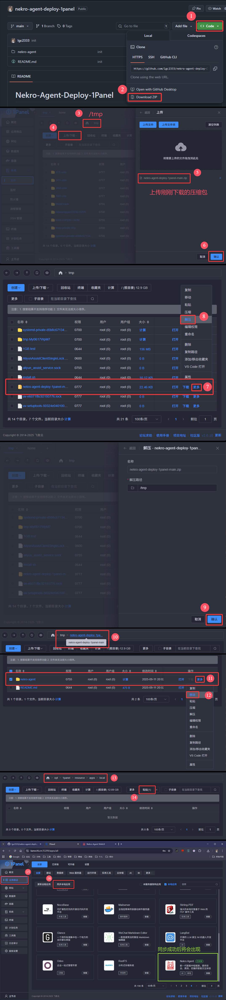
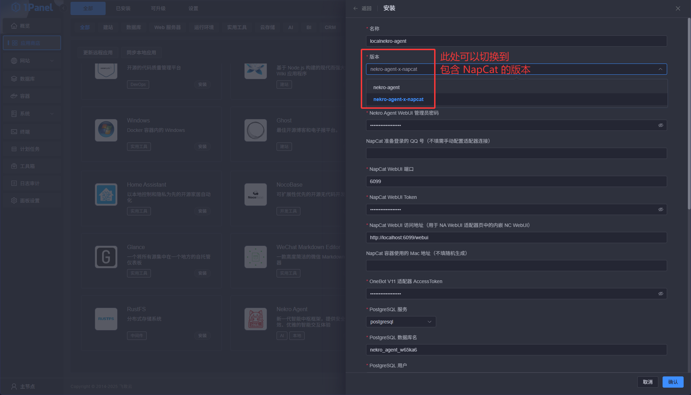
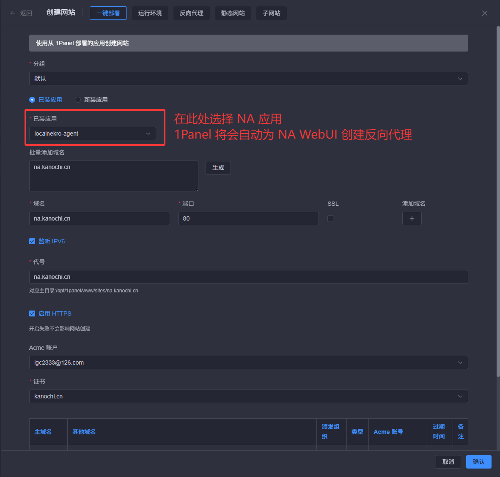
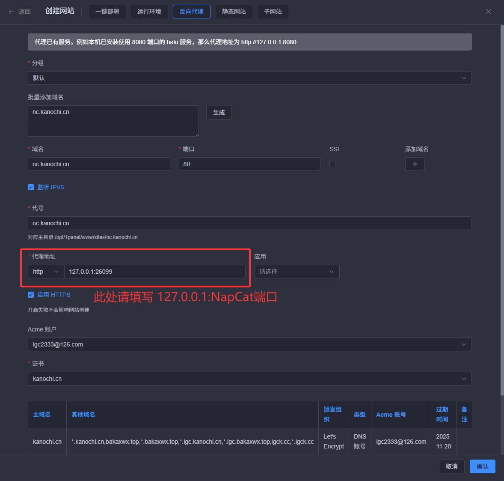
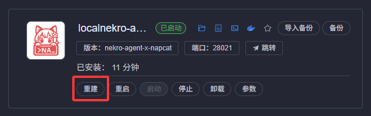

<!-- markdownlint-disable MD033 MD036 -->

# Nekro-Agent-Deploy-1Panel

以 1Panel 应用方式部署 Nekro Agent

## 注意事项

应用安装或更新时，执行 init 或 upgrade 脚本所需耗时可能会有点长，这是因为它正在拉取本应用运行所需的额外 Docker 镜像，请保持良好的网络连接并耐心等待。  
也请注意清理未使用镜像时请勿清除 `kromiose/nekro-agent-sandbox` 镜像，否则将会导致本应用无法正常运行！如误删请手动重新拉取。

## 如何安装

### 1. 安装本项目至 1Panel 本地应用中

依次执行以下命令：

```bash
wget -O /tmp/nekro-1p.zip https://github.com/lgc2333/nekro-agent-deploy-1panel/archive/refs/heads/main.zip
sudo unzip /tmp/nekro-1p.zip -d /tmp
sudo cp -rv /tmp/nekro-agent-deploy-1panel-main/nekro-agent /opt/1panel/resource/apps/local
```



### 2. 从 1Panel 应用商店安装 NA

按需填写其中的配置项即可  
如需要对公网公开，但不希望使用 OpenResty 反代 NA 与 NC 的 WebUI，请向下滚动找到 `端口外部访问`，将其打开

<details>
<summary>点击展开/折叠详细步骤</summary>



</details>

### 3. 如需使用 OpenResty 反代……

#### 反代 NA

使用 `一键部署` 功能创建一个网站即可

<details>
<summary>点击展开/折叠详细步骤</summary>



</details>

#### 反代 NC

如果你同时部署了 NC，由于 1Panel 仅允许对同一个应用设置一个 HTTP 服务端口，所以在使用 `一键部署` 创建完 NA WebUI 的网站后，还需要手动使用 `反向代理` 功能创建 NC WebUI 的网站

<details>
<summary>点击展开/折叠详细步骤</summary>



</details>

## 如何更新

在已安装的 NA 上点击 `重建` 即可

_（没测试过，应该是能更新上的吧（（（如果有问题进群问我_



## 反馈/答疑

请从下方寻找并加入 Nekro Agent 的 QQ 或 TG 群询问：  
<https://github.com/KroMiose/nekro-agent#readme>

本人的账号：

- QQ: 3076823485
- TG: @lgc2333
